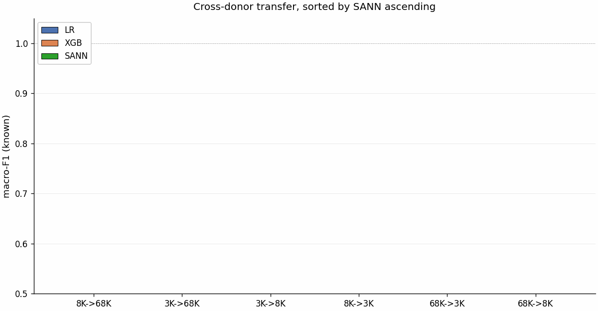

# scRNA-robust-ml

Robustness benchmarking of machine learning models for cell type classification on single-cell RNA-seq data. Compares Logistic Regression, XGBoost, and a custom Sparse-Aware Neural Network (SANN) across two feature representations (HVG and PCA) using the PBMC68K dataset.

<p align="center">
  
  <br/>
  <em>3D UMAP of PBMC68K, coloured by SANN_PCA predictions.</em>
</p>

## Datasets

Three 10x Genomics PBMC donors are used:

- **PBMC68K**: ~68,000 cells. Primary training set for within-donor benchmarking. Cell types annotated via Leiden clustering with canonical PBMC marker genes (T cells, CD8 T, NK, B cells, Plasma, Monocytes, Dendritic cells, Platelets).
- **PBMC8K**: ~8,400 cells. Used as a cross-donor test set (and, in a separate experiment, as a smaller training set evaluated on 3K and 68K).
- **PBMC3K**: ~2,700 cells. Smallest donor; used as a cross-donor test set and as a stress-test training set.

Each donor goes through its own preprocessing script before any model is trained or evaluated.

## Models

| Model | Description |
|---|---|
| **Logistic Regression** | L2-regularised, grid search over C values, LBFGS solver |
| **XGBoost** | Multi-class softmax, histogram-based tree method, early stopping |
| **SANN** | Sparse-Aware Neural Network. HVG variant: 2-layer MLP over [scaled expression \| binary sparsity mask]. PCA variant (`SANN_PCA`): dual-encoder with separate expression and mask branches, residual blocks, gated fusion |

## Feature Representations

- **HVG**: top 2,000 highly variable genes from scanpy, standardised per-split using training statistics only
- **PCA**: first 50 principal components from the preprocessed expression matrix

## Project Structure

```
scRNA-robust-ml/
├── data/
│   ├── raw/pbmc68k/          # Raw 10x MTX files
│   └── processed/            # Preprocessed and annotated .h5ad files
├── splits/                   # 5 stratified train/test splits (80/20, JSON)
├── src/
│   ├── preprocess.py            # 68K: QC, normalisation, HVG selection, PCA
│   ├── preprocess_pbmc8k.py     # 8K: QC + log-norm + alignment to 68K HVGs
│   ├── preprocess_pbmc3k.py     # 3K: QC + log-norm + per-gene mean/std stats
│   ├── annotate.py              # Marker-based cell type annotation
│   ├── make_splits.py           # Stratified split generation
│   ├── train_all_full_models.py # Train LR, XGB, SANN on HVG features (68K)
│   ├── train_all_pca_models.py  # Train LR, XGB, SANN on PCA features  (68K)
│   ├── train_8k_eval_3k_68k.py  # Train on 8K, external eval on 3K + 68K
│   ├── train_3k_eval_8k_68k.py  # Train on 3K, external eval on 8K + 68K
│   ├── eval_robustness_splits_full.py  # Robustness evaluation across splits
│   ├── ablation_sann.py         # SANN ablation studies
│   ├── calibrate.py             # ECE calculation and reliability diagrams
│   ├── temp_scale_sann.py       # Temperature scaling for SANN
│   ├── plot_transfer_matrix.py  # Build the 3x3 cross-donor macro-F1 matrix
│   └── plot_*.py                # Other visualisation scripts (UMAP, confusion, radar, etc.)
├── tests/                    # Unit tests (pytest)
├── results/                  # Trained models, metrics, predictions, and per-experiment figures (results/figures/)
├── figures/                  # Top-level summary plots (radar, robustness, pairwise tests)
├── configs/                  # Configuration files
├── notebooks/                # Jupyter notebooks
└── requirements.txt
```

## Setup

```bash
# Create environment
conda create -n scrna python=3.9 -y
conda activate scrna

# Install dependencies
pip install -r requirements.txt
pip install torch pytest
```

## Pipeline

```bash
# 1. Preprocess raw data (one script per donor)
python src/preprocess.py
python src/preprocess_pbmc8k.py
python src/preprocess_pbmc3k.py

# 2. Annotate cell types
python src/annotate.py

# 3. Generate stratified splits
python src/make_splits.py

# 4. Train all models (HVG features, 68K-trained)
python src/train_all_full_models.py

# 5. Train all models (PCA features, 68K-trained)
python src/train_all_pca_models.py

# 6. Evaluate robustness across splits
python src/eval_robustness_splits_full.py

# 7. Calibration analysis
python src/calibrate.py

# 8. Cross-donor transfer evaluation (8K-trained and 3K-trained)
python src/train_8k_eval_3k_68k.py
python src/train_3k_eval_8k_68k.py

# 9. Build the 3x3 transfer matrix and the bar-chart figure
python src/plot_transfer_matrix.py
python src/make_transfer_bar_gif.py
```

## Evaluation

- **Accuracy** and **macro-F1** across 5 stratified splits
- **Robustness**: variance of metrics across splits for HVG vs PCA
- **Confidence calibration**: Expected Calibration Error (ECE) and reliability diagrams
- **Error analysis**: confusion matrices, misclassified cell UMAP projections
- **Ablation studies**: SANN architecture choices (hidden size, dropout, batchnorm, sparsity mask)
- **Cross-donor transfer**: macro-F1 across the 6 train/test rotations of the 3K, 8K, and 68K donors
- **Runtime** comparison across models and feature types

<p align="center">
  
  <br/>
  <em>Cross-donor macro-F1 across the 6 train/test rotations of the 3K, 8K, and 68K donors.</em>
</p>

## Testing

```bash
pytest tests/ -v
```

Tests cover:
- Sparsity mask generation (`build_sann_input`)
- Data loading, splitting, and standardisation utilities
- SANN forward pass (both architecture variants)
- Expected Calibration Error (ECE) calculation

## Requirements

Tested with Python 3.9. Pinned versions live in `requirements.txt`. Headline pins:

- numpy 1.24, pandas 1.4, scipy 1.13, scikit-learn 1.6, joblib 1.5
- scanpy 1.9, anndata 0.10, umap-learn 0.5, leidenalg 0.11, igraph 1.0
- xgboost 2.1, torch 2.2
- matplotlib 3.9, seaborn 0.13, pillow >= 10 (animated GIFs)
- pytest 7.1
