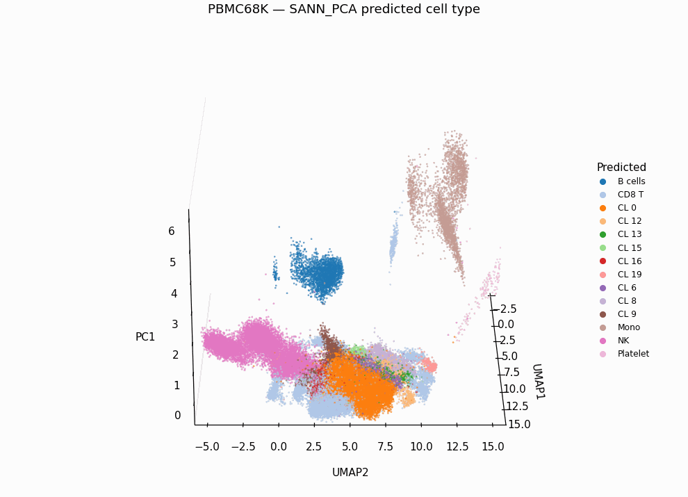

# scRNA-robust-ml

Robustness benchmarking of machine learning models for cell type classification on single-cell RNA-seq data. Compares Logistic Regression, XGBoost, and a custom Sparse-Aware Neural Network (SANN) across two feature representations (HVG and PCA) using the PBMC68K dataset.

<p align="center">
  
  <br/>
  <em>3D UMAP of PBMC68K coloured by SANN_PCA predicted cell type.</em>
</p>

## Dataset

**PBMC68K** — ~68,000 peripheral blood mononuclear cells (10x Genomics). Cell types are annotated via Leiden clustering with canonical PBMC marker genes (T cells, CD8 T, NK, B cells, Plasma, Monocytes, Dendritic cells, Platelets).

## Models

| Model | Description |
|---|---|
| **Logistic Regression** | L2-regularised, grid search over C values, LBFGS solver |
| **XGBoost** | Multi-class softmax, histogram-based tree method, early stopping |
| **SANN** | Sparse-Aware Neural Network — concatenates scaled expression with a binary sparsity mask as input; 2-layer MLP with BatchNorm, ReLU/GELU, Dropout |

## Feature Representations

- **HVG** — Top 2,000 highly variable genes selected via scanpy, standardised per-split using training statistics only
- **PCA** — First 50 principal components from the preprocessed expression matrix

## Project Structure

```
scRNA-robust-ml/
├── data/
│   ├── raw/pbmc68k/          # Raw 10x MTX files
│   └── processed/            # Preprocessed and annotated .h5ad files
├── splits/                   # 5 stratified train/test splits (80/20, JSON)
├── src/
│   ├── preprocess.py         # QC, normalisation, HVG selection, PCA
│   ├── annotate.py           # Marker-based cell type annotation
│   ├── make_splits.py        # Stratified split generation
│   ├── train_all_full_models.py   # Train LR, XGB, SANN on HVG features
│   ├── train_all_pca_models.py    # Train LR, XGB, SANN on PCA features
│   ├── eval_robustness_splits_full.py  # Robustness evaluation across splits
│   ├── ablation_sann.py      # SANN ablation studies
│   ├── calibrate.py          # ECE calculation and reliability diagrams
│   ├── temp_scale_sann.py    # Temperature scaling for SANN
│   └── plot_*.py             # Visualisation scripts (UMAP, confusion, radar, etc.)
├── tests/                    # Unit tests (pytest)
├── results/                  # Trained models, metrics, predictions
├── figures/                  # Generated plots and comparison figures
├── configs/                  # Configuration files
├── notebooks/                # Jupyter notebooks
└── requirements.txt
```

## Setup

```bash
# Create environment
conda create -n scrna python=3.9 -y
conda activate scrna

# Install dependencies
pip install -r requirements.txt
pip install torch pytest
```

## Pipeline

```bash
# 1. Preprocess raw data
python src/preprocess.py

# 2. Annotate cell types
python src/annotate.py

# 3. Generate stratified splits
python src/make_splits.py

# 4. Train all models (HVG features)
python src/train_all_full_models.py

# 5. Train all models (PCA features)
python src/train_all_pca_models.py

# 6. Evaluate robustness across splits
python src/eval_robustness_splits_full.py

# 7. Calibration analysis
python src/calibrate.py
```

## Evaluation

- **Accuracy** and **Macro-F1** across 5 stratified splits
- **Robustness** — variance of metrics across splits for HVG vs PCA
- **Confidence calibration** — Expected Calibration Error (ECE) and reliability diagrams
- **Error analysis** — confusion matrices, misclassified cell UMAP projections
- **Ablation studies** — SANN architecture choices (hidden size, dropout, batchnorm, sparsity mask)
- **Runtime** comparison across models and feature types

## Testing

```bash
pytest tests/ -v
```

Tests cover:
- Sparsity mask generation (`build_sann_input`)
- Data loading, splitting, and standardisation utilities
- SANN forward pass (both architecture variants)
- Expected Calibration Error (ECE) calculation

## Requirements

- Python 3.9+
- scanpy >= 1.9
- anndata >= 0.10
- scikit-learn >= 1.3
- xgboost >= 2.0
- PyTorch
- matplotlib >= 3.8
- pandas >= 2.0
- umap-learn >= 0.5
